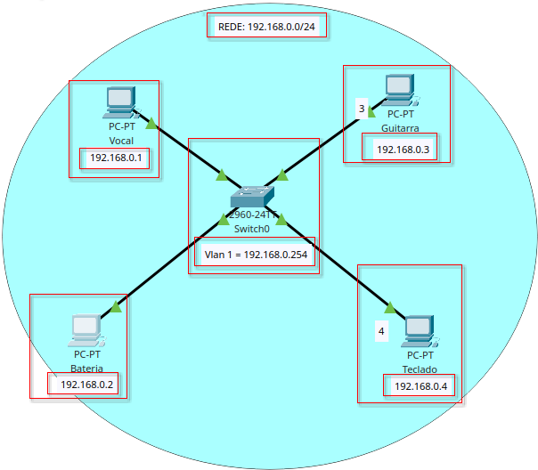
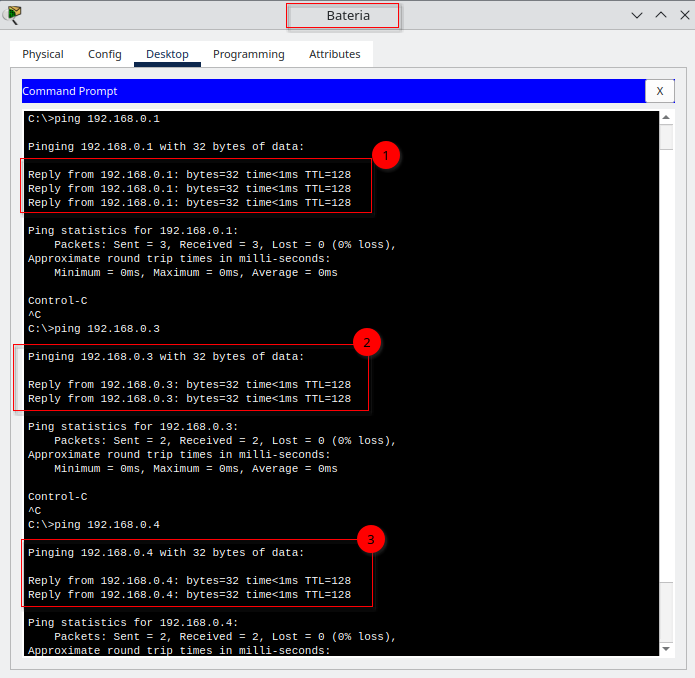

# Projeto: Rede de Comunicação para o Show da Banda de Miguel
Este é um projeto de redes de computadores do curso  <i>Redes e Linux Essentials para AWS</i> da <i>Proz Educação</i>.
Ele visa configurar uma rede de computadores para a equipe de produção do show da banda de Miguel, utilizando o Cisco Packet Tracer. A comunicação eficiente entre os membros da equipe é crucial para garantir que tudo ocorra conforme o planejado.

## Objetivos

- Criar uma topologia de rede estrela para facilitar a comunicação entre os membros da equipe.
- Garantir que todos os computadores estejam configurados corretamente e possam se comunicar entre si.

## Passos para a Configuração

### 1. Definir o Cenário
- Cada membro da equipe possui um computador que precisa de uma conexão de rede para se comunicar com os outros.

### 2. Montar a Topologia
- Crie uma nova topologia no Cisco Packet Tracer.
- Adicione um switch ao centro da área de trabalho.
- Posicione quatro PCs ao redor do switch, representando a equipe de produção.

### 3. Conectar os Dispositivos
- Conecte cada PC a uma porta diferente no switch usando cabos Ethernet.
- A disposição deve formar uma estrela em torno do switch central.

### 4. Configurar os Endereços IP
- Atribua nomes e endereços IP únicos para cada computador.
- Configure os endereços IP para as interfaces dos PCs e do switch na mesma sub-rede.

### 5. Testar a Comunicação
- Acesse um dos PCs, abra o prompt de comando e execute um comando `ping` para o endereço IP de outro computador da equipe.
- Verifique se todos os computadores estão se comunicando corretamente.

## Entrega

- Faça um print da tela com a topologia

- Faça um print da tela com o  comando ping executado entre os computadores.
  

## Contribuições

Sinta-se à vontade para contribuir com melhorias ou sugestões. Para isso, basta abrir uma issue ou enviar um pull request.

## Licença

Este projeto está licenciado sob a [Licença MIT](LICENSE).

